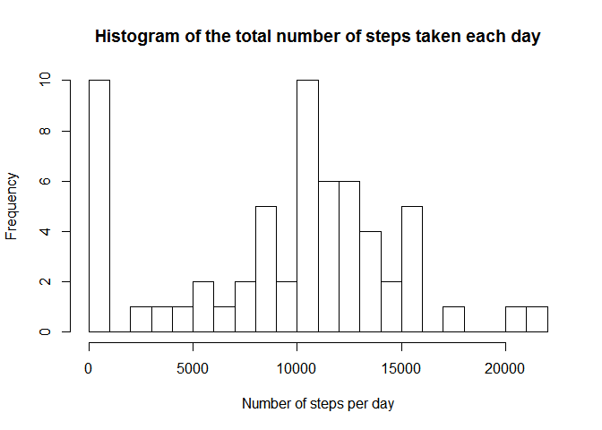
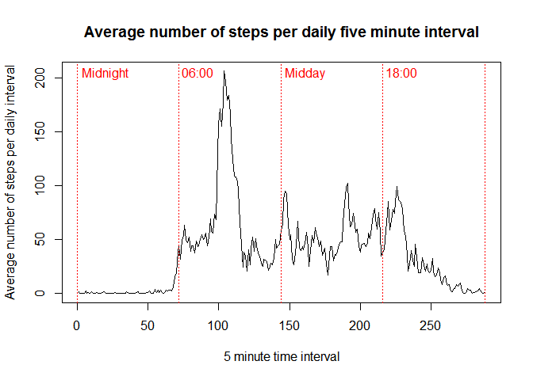
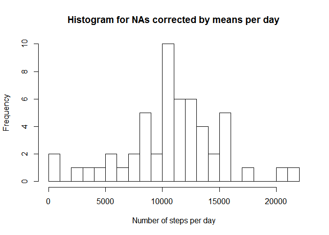
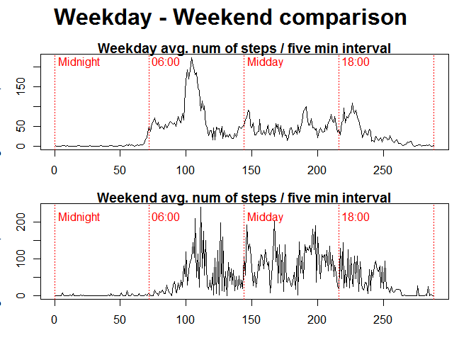

# Reproducible Research: Peer Assessment 1
pszjmb1  

# Utility Functions

```r
timeprint <- function(s){
  # Prints out the given string with a datestamp
  #
  # args:
  #  s: The string to print
  s <- paste(format(Sys.time(), "%a %b %d %H:%M:%S %Y"),s,sep="> ")
  print(s)
}
```
# Load and preprocess the data

```r
if(!file.exists("data")){dir.create("data")}

## Download data
fileURL <- "https://d396qusza40orc.cloudfront.net/repdata%2Fdata%2Factivity.zip"
if(!file.exists("./data/activity.zip")){
    timeprint("Downloading data...")
    download.file(fileURL, destfile = './data/activity.zip', method="curl")
    outputMsg <- paste("Raw data downloaded from:", fileURL," ", date())    
    write(outputMsg, file = paste("./data/", "activity.zip", ".download.info.md", sep=""))
    unzip('./data/activity.zip',exdir='./data')
} else{
  con <- file("./data/activity.zip.download.info.md", "rt")  
  outputMsg <- readLines(con, 1)
}
timeprint(outputMsg)
```

```
## [1] "Sat Jun 13 18:13:35 2015> Raw data downloaded from: https://d396qusza40orc.cloudfront.net/repdata%2Fdata%2Factivity.zip   Sat Jun 13 18:11:39 2015"
```

```r
activityData <- read.csv2("./data/activity.csv", sep=",", header=TRUE)
str(activityData)
```

```
## 'data.frame':	17568 obs. of  3 variables:
##  $ steps   : int  NA NA NA NA NA NA NA NA NA NA ...
##  $ date    : Factor w/ 61 levels "2012-10-01","2012-10-02",..: 1 1 1 1 1 1 1 1 1 1 ...
##  $ interval: int  0 5 10 15 20 25 30 35 40 45 ...
```

# Show the mean total number of steps taken per day
## Calculate the total number of steps taken per day

```r
numberOfStepsPerDay <- tapply(activityData$steps, activityData$date, sum, na.rm = TRUE)
numberOfStepsPerDay
```

```
## 2012-10-01 2012-10-02 2012-10-03 2012-10-04 2012-10-05 2012-10-06 
##          0        126      11352      12116      13294      15420 
## 2012-10-07 2012-10-08 2012-10-09 2012-10-10 2012-10-11 2012-10-12 
##      11015          0      12811       9900      10304      17382 
## 2012-10-13 2012-10-14 2012-10-15 2012-10-16 2012-10-17 2012-10-18 
##      12426      15098      10139      15084      13452      10056 
## 2012-10-19 2012-10-20 2012-10-21 2012-10-22 2012-10-23 2012-10-24 
##      11829      10395       8821      13460       8918       8355 
## 2012-10-25 2012-10-26 2012-10-27 2012-10-28 2012-10-29 2012-10-30 
##       2492       6778      10119      11458       5018       9819 
## 2012-10-31 2012-11-01 2012-11-02 2012-11-03 2012-11-04 2012-11-05 
##      15414          0      10600      10571          0      10439 
## 2012-11-06 2012-11-07 2012-11-08 2012-11-09 2012-11-10 2012-11-11 
##       8334      12883       3219          0          0      12608 
## 2012-11-12 2012-11-13 2012-11-14 2012-11-15 2012-11-16 2012-11-17 
##      10765       7336          0         41       5441      14339 
## 2012-11-18 2012-11-19 2012-11-20 2012-11-21 2012-11-22 2012-11-23 
##      15110       8841       4472      12787      20427      21194 
## 2012-11-24 2012-11-25 2012-11-26 2012-11-27 2012-11-28 2012-11-29 
##      14478      11834      11162      13646      10183       7047 
## 2012-11-30 
##          0
```

## Histogram of the total number of steps taken each day

```r
hist(numberOfStepsPerDay, main="Histogram of the total number of steps taken each day", xlab="Number of steps per day", breaks=25)
```

 

## Calculate and report the mean and median of the total number of steps taken per day

```r
numberOfStepsPerDay.mean <- mean(numberOfStepsPerDay,na.rm = TRUE)
numberOfStepsPerDay.mean
```

```
## [1] 9354.23
```

```r
numberOfStepsPerDay.median <- median(numberOfStepsPerDay,na.rm = TRUE)
numberOfStepsPerDay.median
```

```
## [1] 10395
```

```r
# Also including std dev
numberOfStepsPerDay.sd <- sd(numberOfStepsPerDay)
numberOfStepsPerDay.sd
```

```
## [1] 5405.895
```

# Show the average daily activity pattern

## Present a time series plot of the 5-minute interval and the average number of steps taken, averaged across all days

```r
avgDailySteps <- tapply(activityData$steps, activityData$interval, mean, na.rm = TRUE)
plot(c(1:288),avgDailySteps, type="l", main = "Average number of steps per daily five minute interval", xlab="5 minute time interval", ylab="Average number of steps per daily interval")
abline(v=0, col = 2, lty="dotted")
text(0,200, "Midnight", col = 2, adj = c(-.1, -.1))
abline(v=72, col = 2, lty="dotted")
text(72,200, "06:00", col = 2, adj = c(-.1, -.1))
abline(v=144, col = 2, lty="dotted")
text(144,200, "Midday", col = 2, adj = c(-.1, -.1))
abline(v=216, col = 2, lty="dotted")
text(216,200, "18:00", col = 2, adj = c(-.1, -.1))
abline(v=288, col = 2, lty="dotted")
```

 

## The 5-minute interval, on average across all the days in the dataset, containing the maximum number of steps:

```r
intervalName <- names(avgDailySteps[names(avgDailySteps)[which.max(as.numeric(avgDailySteps))]])
match(intervalName,names(avgDailySteps))
```

```
## [1] 104
```

# Inputing missing values
## The total number of missing values in the dataset (i.e. the total number of rows with NAs) -- and :

```r
numNas <- sum(is.na(activityData))
timeprint(numNas)
```

```
## [1] "Sun Jun 14 10:28:43 2015> 2304"
```
## Percentage of missing values (not asked for but of interest)

```r
pctNas <- numNas/nrow(activityData)
timeprint(paste0(formatC(100 * pctNas, format="f", digits = 1), "%"))
```

```
## [1] "Sun Jun 14 10:28:43 2015> 13.1%"
```

## Devise a strategy and fill in all missing values in the dataset. 

Here, the strategy is to use the mean per day values to impute the means. The method is based on [a comment by Hadley Wickham](http://www.mail-archive.com/r-help@r-project.org/msg58289.html).

```r
impute.mean <- function(x) replace(x, is.na(x), mean(x, na.rm = TRUE))   # from Hadley Wickham's comment
library(plyr)
activityData.naCorrectedByDailyMeans <- ddply(activityData, ~ date, transform, steps = impute.mean(steps))
activityData.naCorrectedByDailyMeans$steps[is.na(activityData.naCorrectedByDailyMeans$steps)] <- 0  # This corrects any days that have no recordings
```

## Histogram of total number of steps taken each day 


```r
numberOfStepsPerDay.naCorrectedByDailyMeans <- tapply(activityData.naCorrectedByDailyMeans$steps, activityData.naCorrectedByDailyMeans$date, sum)
hist(numberOfStepsPerDay.naCorrectedByDailyMeans, main="Histogram for NAs corrected by means per day", xlab="Number of steps per day", breaks=25)
```

 

## Calculate and report the mean and median total number of steps taken per day. 


```r
numberOfStepsPerDay.naCorrectedByDailyMeans.mean <- mean(numberOfStepsPerDay.naCorrectedByDailyMeans,na.rm = TRUE)
numberOfStepsPerDay.naCorrectedByDailyMeans.mean
```

```
## [1] 10766.19
```

```r
numberOfStepsPerDay.naCorrectedByDailyMeans.median <- median(numberOfStepsPerDay.naCorrectedByDailyMeans,na.rm = TRUE)
numberOfStepsPerDay.naCorrectedByDailyMeans.median
```

```
## [1] 10765
```

```r
# Also including std dev
numberOfStepsPerDay.naCorrectedByDailyMeans.sd <- sd(numberOfStepsPerDay)
numberOfStepsPerDay.naCorrectedByDailyMeans.sd
```

```
## [1] 5405.895
```

## Differences of imputed values from first part of assignment estimates

```r
numberOfStepsPerDay.mean - numberOfStepsPerDay.naCorrectedByDailyMeans.mean
```

```
## [1] -1411.959
```

```r
numberOfStepsPerDay.median - numberOfStepsPerDay.naCorrectedByDailyMeans.median
```

```
## [1] -370
```

```r
numberOfStepsPerDay.sd - numberOfStepsPerDay.naCorrectedByDailyMeans.sd
```

```
## [1] 0
```

```r
pctDifMean <- numberOfStepsPerDay.mean / numberOfStepsPerDay.naCorrectedByDailyMeans.mean
pctDifMedian <- numberOfStepsPerDay.median / numberOfStepsPerDay.naCorrectedByDailyMeans.median
pctDifMean <- paste0(formatC(100 * (1- pctDifMean), format="f", digits = 1), "%")
pctDifMedian <- paste0(formatC(100 * (1- pctDifMedian), format="f", digits = 1), "%")
```

The imputed mean and median are slightly higher (13.1% and 3.4% respectively), and closer together. There is no impact on stad. dev.

## What is the impact of imputing missing data on the estimates of the total daily number of steps?

There is no impact. This is known from examining the differences between numberOfStepsPerDay.naCorrectedByDailyMeans and numberOfStepsPerDay: 0, 0, 0, 0, 0, 0, 0, 0, 0, 0, 0, 0, 0, 0, 0, 0, 0, 0, 0, 0, 0, 0, 0, 0, 0, 0, 0, 0, 0, 0, 0, 0, 0, 0, 0, 0, 0, 0, 0, 0, 0, 0, 0, 0, 0, 0, 0, 0, 0, 0, 0, 0, 0, 0, 0, 0, 0, 0, 0, 0, 0.

# Are there differences in activity patterns between weekdays and weekends?
## Create a new factor variable in the dataset with two levels - "weekday" and "weekend" indicating whether a given date is a weekday or weekend day.

```r
activityData$dayType = ifelse(weekdays(as.POSIXlt(activityData$date)) == c("Saturday","Sunday"), "weekend", "weekday")
```

## Make a panel plot containing a time series plot (i.e. type = "l") of the 5-minute interval (x-axis) and the average number of steps taken, averaged across all weekday days or weekend days (y-axis). 

```r
avgDailySteps.weekday <- tapply(activityData$steps[activityData$dayType == "weekday"], activityData$interval[activityData$dayType == "weekday"], mean, na.rm = TRUE)
avgDailySteps.weekend <- tapply(activityData$steps[activityData$dayType == "weekend"], activityData$interval[activityData$dayType == "weekend"], mean, na.rm = TRUE)

oldpar <- par(mfrow=c(2,1), mar=c(3,3,1,1), oma=c(0,0,3,1))  ## oma creates space 
plot(c(1:288),avgDailySteps.weekday, type="l", main = "Weekday avg. num of steps / five min interval", xlab="5 min interval", ylab="Avg. num. of steps / interval")
abline(v=0, col = 2, lty="dotted")
text(0,200, "Midnight", col = 2, adj = c(-.1, -.1))
abline(v=72, col = 2, lty="dotted")
text(72,200, "06:00", col = 2, adj = c(-.1, -.1))
abline(v=144, col = 2, lty="dotted")
text(144,200, "Midday", col = 2, adj = c(-.1, -.1))
abline(v=216, col = 2, lty="dotted")
text(216,200, "18:00", col = 2, adj = c(-.1, -.1))
abline(v=288, col = 2, lty="dotted")

plot(c(1:288),avgDailySteps.weekend, type="l", main = "Weekend avg. num of steps / five min interval", xlab="5 min interval", ylab="Avg. num. of steps / interval")
abline(v=0, col = 2, lty="dotted")
text(0,200, "Midnight", col = 2, adj = c(-.1, -.1))
abline(v=72, col = 2, lty="dotted")
text(72,200, "06:00", col = 2, adj = c(-.1, -.1))
abline(v=144, col = 2, lty="dotted")
text(144,200, "Midday", col = 2, adj = c(-.1, -.1))
abline(v=216, col = 2, lty="dotted")
text(216,200, "18:00", col = 2, adj = c(-.1, -.1))
abline(v=288, col = 2, lty="dotted")

mtext("Weekday - Weekend comparison", side=3, line=1, outer=TRUE, cex=2, font=2)
```

 

```r
par(oldpar)
```

